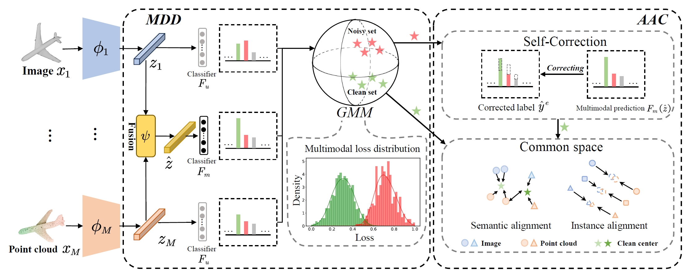

## DAC
Chaofan Gan, Yuanpeng Tu, Yuxi Li, Weiyao Lin: DAC: 2D-3D Retrieval with Noisy Labels via Divide-and-Conquer Alignment and Correction [[Arxiv](https://arxiv.org/abs/2407.17779)] (ACM MM 2024, PyTorch Code)

## Abstract
With the recent burst of 2D and 3D data, cross-modal retrieval has attracted increasing attention recently. However, manual labeling by non-experts will inevitably introduce corrupted annotations given ambiguous 2D/3D content. Though previous works have addressed this issue by designing a naive division strategy with hand-crafted thresholds, their performance generally exhibits great sensitivity to the threshold value. Besides, they fail to fully utilize the valuable supervisory signals within each divided subset. To tackle this problem, we propose a Divide-and-conquer 2D-3D cross-modal Alignment and Correction framework (DAC), which comprises Multimodal Dynamic Division (MDD) and Adaptive Alignment and Correction (AAC). Specifically, the former performs accurate sample division by adaptive credibility modeling for each sample based on the compensation information within multimodal loss distribution. Then in AAC, samples in distinct subsets are exploited with different alignment strategies to fully enhance the semantic compactness and meanwhile alleviate over-fitting to noisy labels, where a self-correction strategy is introduced to improve the quality of representation. Moreover. To evaluate the effectiveness in real-world scenarios, we introduce a challenging noisy benchmark, namely Objaverse-N200, which comprises 200k-level samples annotated with 1156 realistic noisy labels. Extensive experiments on both traditional and the newly proposed benchmarks demonstrate the generality and superiority of our DAC, where DAC outperforms state-of-the-art models by a large margin. (i.e., with +5.9\% gain on ModelNet40 and +5.8\% on Objaverse-N200).

## Framework


## Requirements
- Python 3.8
- PyTorch 1.7.1
- CUDA 10.2
- torchvision 0.8.2
- numpy 1.19.5
- scipy 1.5.4
- scikit-learn 0.24.2

## Dataset
#### ModelNet
The point cloud data and noisy labels can be found from [RONO](https://github.com/penghu-cs/RONO/tree/ModelNet). All the 180-view images in ModelNet10/40 could be find in [CrossmodalCenterLoss](https://github.com/LongLong-Jing/Cross-Modal-Center-Loss/issues/2). 

### Objaverse-N200
We developed a realistic and noisy benchmark, Objaverse-N200, built upon the recently proposed 3D dataset, Objaverse. We utilize a large pre-trained model Uni3D to assign categories to these objects. The noisy labels colud be found in ./data/train_200.json. 
```json
{
        "uid": "1728a97697d94d2f8c5cb910c5f213ce",
        "group": "000-016",
        "category": "Band_Aid"
    },
    {
        "uid": "cedddfce7eda4e81b984219e61047d14",
        "group": "000-027",
        "category": "Band_Aid"
    },
    {
        "uid": "25b0f6c7a18940f1bc0519402ec002ca",
        "group": "000-076",
        "category": "Band_Aid"
    },
```

And we use processed objaverse feature from pre-trained models [Openshape](https://github.com/Colin97/OpenShape_code). We adopt [Objaverse-lvis](https://huggingface.co/datasets/allenai/objaverse/tree/main) as test set.

## Training and Testing
```python
bash train.sh
```

## Citation
If you find this code useful for your research, please consider citing our paper:
```
@inproceedings{
gan2024dac,
title={{DAC}: 2D-3D Retrieval with Noisy Labels via Divide-and-Conquer Alignment and Correction},
author={Chaofan Gan and Yuanpeng Tu and Yuxi Li and Weiyao Lin},
booktitle={ACM Multimedia 2024},
year={2024},
}
```


